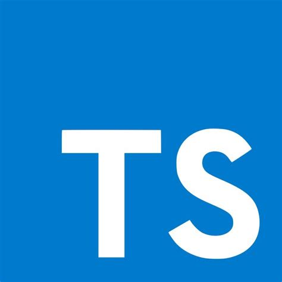
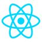

  
### Sobre

Sou fascinado por programação, comecei minha jornada em 2016 e desde do começo eu sempre procurei aprender várias tecnologias. Hoje me considero um
desenvolvedor *generalista*, porém meus projetos estão mais voltados para a Web/Mobile e a maioria deles podem ser encontrados aqui no Github.

### Linguagens/Frameworks e Tecnologias

> Algumas linguagens/frameworks e tecnologias que eu uso para desenvolver meus projetos.

### Aprendendo

> O que eu estou aprendendo atualmente.

